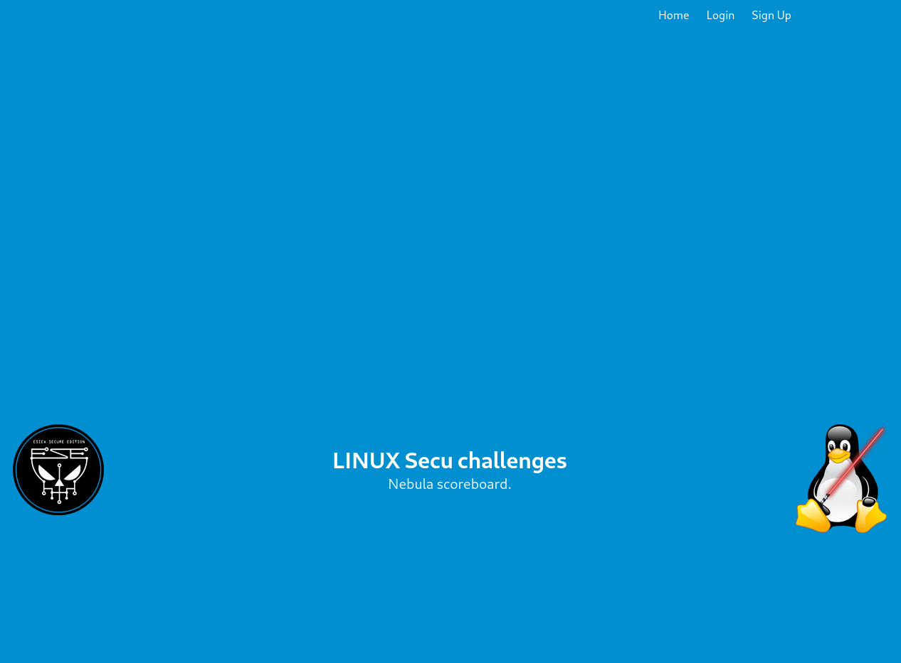
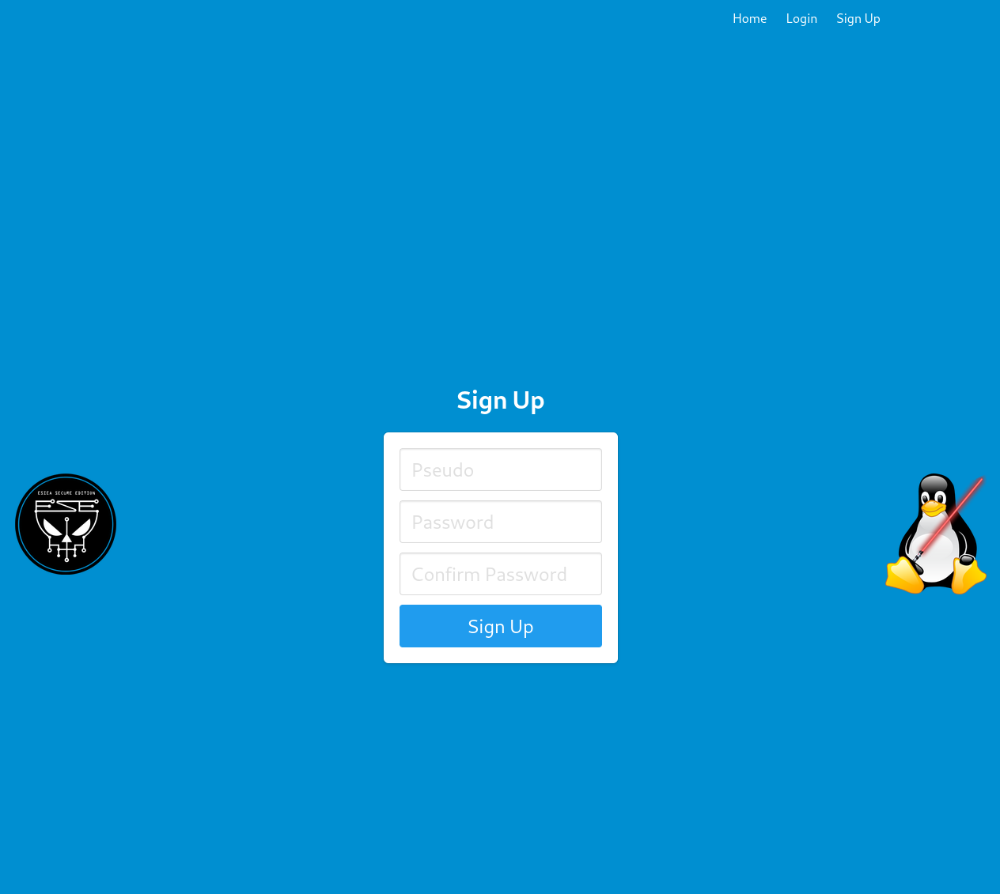
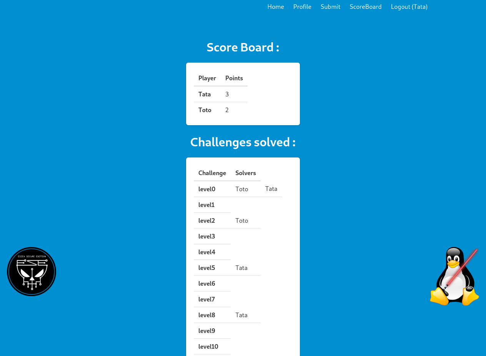

# CTF ScoreBoard

You are teaching some technical stuff and trying to add some entertainments for your courses, here is a minimalistic scoreboard in the spirit of CTFd.

It allows your students to simply :
- Sign in / log in / log out
- Validate challenges through flag submission
- Monitor the score board

## Deployment

For the moment it uses the embeded testing flask web-server.

Maybe I will put all of it into some docker soon.

However, do not use it into any production environement nor on the Internet, it is just made for local LAN usage into your classes.

## Configuration

You can customize apparence while modifying logos and picutres inside `static/`

And other stuff inside `html` pages.

Modify `create_db.py` with your own challenges specifications (names, flags and points)


## Setup

```bash
python3 -m'venv' venv
source venv/bin/activate
pip3 install -r requirements.txt
chmod +x launch.sh
./launch.sh
```

WARNING : `create_db.py` called by `launch.sh` will erase existing database in order to start a fresh instance.

## SnapShots

<p align="center">
  
</p>

<p align="center">
  
</p>

<p align="center">
  
</p>
